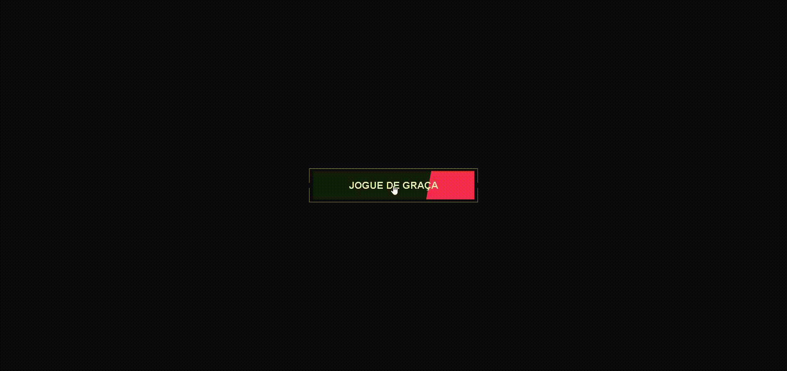

# 🔥 Botão Animado Interativo  

Um **botão animado** desenvolvido com **HTML, CSS e JavaScript**, com efeitos visuais modernos e interativos.  
Ao clicar, o botão muda de cor e o texto é atualizado, proporcionando **feedback visual instantâneo** ao usuário.  

  

---

## 🚀 Tecnologias Utilizadas  

- 🌐 **HTML5** → Estrutura do botão  
- 🎨 **CSS3** → Estilização, hover e animações  
- ⚡ **JavaScript** → Interatividade e mudança de estado do botão  

---

## 🎯 Funcionalidades  

✅ Efeito hover com transição suave  
✅ Clique altera o texto e a cor do botão  
✅ Design minimalista e responsivo  
✅ Fácil de integrar em qualquer página web  

---

## 📂 Estrutura do Projeto  

```bash
📁 botao-animado
├── index.html       # Estrutura HTML
├── style.css        # Estilização e animações
├── script.js        # Lógica do clique e mudança de texto
├── assets/
│   └── animation.gif     # Demonstração animada do botão
└── README.md        # Documentação
